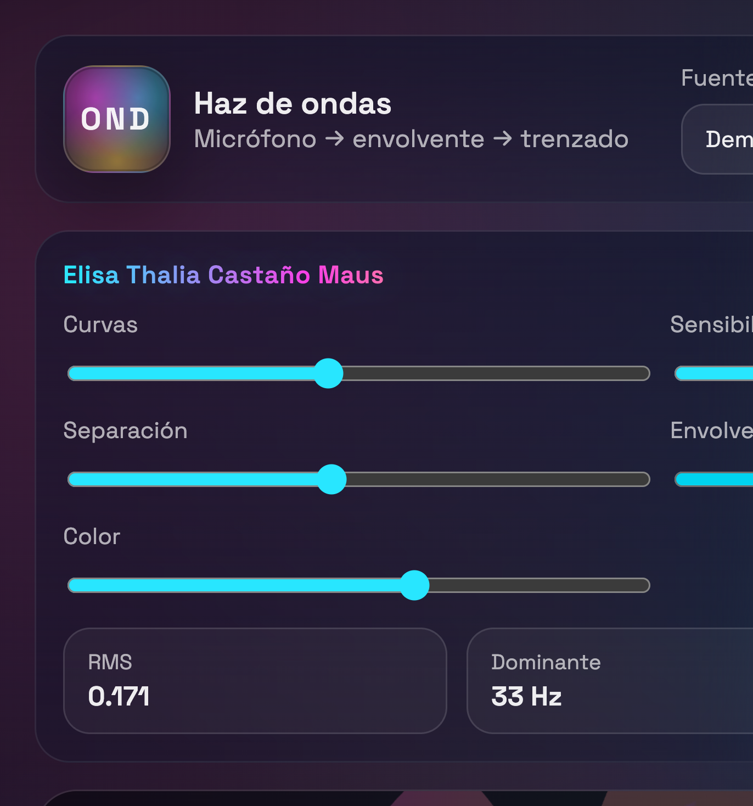

# OND — Haz de ondas (bundle) + visión “música/social” (Epic)

Prototipo visual en **Canvas 2D** inspirado en un “haz” de senoidales superpuestas con **envolvente lenta**, **colores vivos** y micro-animaciones en los detalles (OND v2).

Este repo es el **núcleo visual/audio** y el punto de partida de una visión más grande:

- Una app que, solo por descargarla, da acceso a las **canciones del catálogo del creador** (gratis, sin fricción).
- Evolución a red social creativa: publicaciones tipo feed (fotos/texto), **canciones/letras**, y también **obras 3D** y **código** (playground estilo “Spark”).

Roadmap completo: `./ROADMAP.md`



## Ejecutar

### Opción A (recomendado): servidor con **librosa** (pitch + nota)

Incluye detección de **frecuencia fundamental** y **nota musical** en tiempo real.

```bash
cd /Users/blackmamba/OND
python3 -m pip install -r requirements.txt
python3 server.py --port 8081
```

Abre `http://127.0.0.1:8081` y pulsa **Iniciar**.

### Opción B (simple): solo estático (nota aproximada por FFT)

Por permisos de micrófono, sirve el proyecto en `localhost`:

```bash
cd /Users/blackmamba/OND
python3 -m http.server 8080
```

Abre `http://localhost:8080` y pulsa **Iniciar**.
Si el puerto `8080` está ocupado, usa por ejemplo `8081`.

## Qué hace hoy (OND v2)

- “Haz” de curvas (bundle) con envolvente (burbujas) y trenzado.
- Reacción al audio: RMS, centroid/dominante, bandas (graves/medios/agudos).
- Detección de **nota musical**:
  - Con `server.py` usa `librosa` (YIN) para frecuencia fundamental + nota.
  - Sin server, muestra una nota aproximada por pico FFT.

## Modelo matemático (lo esencial)

Para cada línea `i` (de `0..M-1`), en `x ∈ [0,1]`:

- Envolvente (lenta): `E(x,t)`
- Frecuencia (ciclos a lo largo del ancho): `f_i = f0 + (i/M - 1/2)·Δf`
- Fase: `φ_i(t) = (i/M - 1/2)·twist + ωt`

Curva:

`y_i(x,t) = y0 + offset(i) + sin(2π f_i x + φ_i(t)) · (A · E(x,t))`

Mapeo desde audio:

- **RMS** → `A` (apertura/grosor)
- **Centroid / dominante** → `f0` y densidad
- **Bandas** (graves/medios/agudos) → `E(x,t)`, brillo y velocidad de color

## Controles

- **Curvas**: cuántas líneas se dibujan.
- **Sensibilidad**: cuánto “abre” con el RMS.
- **Separación**: cuánto se separan frecuencias/fases entre líneas.
- **Envolvente**: tamaño/velocidad de las “burbujas”.
- **Color**: saturación/velocidad de desplazamiento de tono.

## Principios del producto (visión)

- **Gratis por descarga** (catálogo del creador): distribución simple, offline-friendly.
- **Orden piramidal**: primero utilidad/velocidad/estabilidad → luego features.
- **Colores vivos + detalles animados**: identidad visual consistente.
- **Creador primero**: música, letra, imagen, 3D y código en el mismo perfil.

> Importante: solo se debe distribuir/publicar contenido sobre el que tengas derechos/licencias.

## Créditos

- Elisa Thalia Castaño Maus
